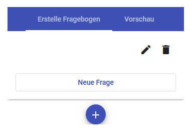

## Kurzanleitung einzelner UseCases

=== UserRolle: Admin
Aus technischen Gründen ist es unvermeidbar einen Default User per SQL anzulegen.
Das mitgelieferte SQL Skript um die Tabellen anzulegen enthält auch einen Insert Befehl, damit dieser Benutzer angelegt wird.

Alternativ kann der folgende Befehl auch manuell angelegt werden:

```
INSERT INTO `user` (uuid,vorname,nachname,email,therapeut,passwort,username,Lat,Lng,techuser,schwellwert)
VALUES
('d5b3e7f2-4545-11ec-81d3-0242ac130003','admin','admin','admin@admin.de',1,'8c6976e5b5410415bde908bd4dee15dfb167a9c873fc4bb8a81f6f2ab448a918','admin',NULL,NULL,1,0);
```

Die Anmeldedaten lauten dann:</br>
Username: admin</br>
Passwort: admin

[#therapeut-anlegen]
==== Therapeut anlegen

Nur der Admin kann über *Sonstiges -> Therapeut aufnehmen* einen neuen Therapeuten anlegen indem die Daten im folgenden Dialog ergänzt werden.

Anschließend wird an die übergebene Email-Adresse eine Email mit den Anmeldedaten versendet.

> In der Testumgebung auf mHealth.mb-media.net werden alle Emails über einen Test-SMTP Server geleitet.
>
> Die Mails können dann unter folgenden Link eingesehen werden:
>
> mHealth.mb-media.net:1080

[#admin-change-password]
==== Passwort ändern
Das eigene Passwort kann über *Sonstiges -> Passwort ändern* angepasst werden.

Dabei werden das Neue und Alte Passwort benötigt.

<<<
=== UserRolle: Therapeut

[#neuen-patient-aufnehmen]
==== neuen Patient aufnehmen

Wurde ein neuer Therapeut angelegt, ist diesem kein Patient zugewiesen.

Über *Sonstiges -> Patient aufnehmen* kann ein neuer Patient analog zu <<therapeut-anlegen>> angelegt werden.

Es gibt aber ein zusätzliches Feld "Schwellwert" zu befüllen.

TODO: Link einfügen

==== aktuellen Patient wählen

Da ein Therapeut mehrere Patienten haben kann, muss vor den meisten Aktionen ein aktueller Patient gesetzt werden.

Dies geschieht über den Button *Patient wählen* im oberen Menüband.

Ist ein Patient gewählt, erscheint im Menüband auch der Name des gewählten Patienten


==== Schwellwerte für Patienten setzen

Die eingegebenen Schwellwerte für die Fragebögen, die über die Funktion <<neuen-patient-aufnehmen>> gesetzt werden, können hier für jeden einzelnen Patienten neu gesetzt werden.

==== Passwort ändern

siehe <<admin-change-password>>

[#kontakt-aufbauen]
==== Kontakt aufbauen

Nach dem der Button "Kontakt hinzufügen" gedrückt wurde, öffnet sich ein Dialog um einen neuen Kontakt zu hinterlegen.
Dabei gibt es kein Pflichtfeld.
Zu beachten ist, dass nur bei syntaktisch richtigen Telefonnummern bzw. Email Adressen später auch die direkt Wahl dieser möglich ist.

Die bereits hinterlegten Kontakte finden sich in der Liste unter dem Menüband.
Je Kontakt und je hinterlegter Daten gibt es die Möglichkeit direkt einen Anruf zu starten, eine Mail zu versenden, den Kontakt zu bearbeiten oder diesen zu entfernen.

<<<
[#warn-add-ort]
==== Warnfunktion Ort hinzufügen

- Als Therapeut ist es möglich über *Warnfunktion -> Ort hinzufügen* für den gewählten Patienten Orte zu hinterlegen.
Dabei kann ein Titel und eine Beschreibung des Ortes, sowie die Koordinaten auf einer Karte gesetzt werden.

(Auch dabei gibt es keine Pflichtfelder)


==== Warnfunktion Ort bearbeiten oder löschen

Die bereits gespeicherten Orte werden ähnlich wie bei der <<kontakt-aufbauen>> Funktion angezeigt.
Bei einem Klick auf die Zeile öffnet sich ein Dialog, in dem der Ort bearbeitet werden kann.
Ansonsten kann der Ort über das Mülltonen Symbol am Ende der Zeile entfernt werden


<<<
[#patientenunterstuetzung]
==== Patientenunterstützung

Analog zu den Funktionen <<kontakt-aufbauen>> und der <<warn-add-ort>> ist auch der Punkt *Patientunterstützung* aufgebaut.

Mit der Besonderheit, dass im Hinzufügen/Bearbeiten Dialog ein HTML-Editor zur Verfügung steht

image::manualScreenshots/massnahmeAdd.png[]

[#datenerhebung]
==== Datenerhebung: Fragebogen erstellen

Über den Menüpunkt *Datenerhebung -> Neuen Fragebogen erstellen*  kann ein neuer Fragebogen erstellt werden.

Dabei sind der Titel bzw. die Beschreibung Pflichtfelder.

Nachdem eingeben des Titels und einer Beschreibung kann ein Fragebogen im Tab "Erstelle Fragebogen" Schritt für Schritt erstellt werden.

> Ein Fragebogen besteht aus Abschnitten, die die Fragen beinhalten

Im ersten Schritt muss ein neuer Abschnitt über den "Add"-Button hinzugefügt werden.


Einem Abschnitt kann ein Titel hinzugefügt werden oder es kann ein kompletter Abschnitt auch wieder entfernt werden.



Sobald ein Abschnitt vorhanden ist, kann über den Button "Neue Frage" eine neue Frage hinzugefügt werden.

Dabei stehen 3 verschiedene Fragetypen zur Auswahl:
- Freitext
- Rating
- Multiple Choice

Bei Freitext Fragen wird zum beantworten ein Textfeld angeboten, bei einem Rating kann zwischen den Werten 0 bis 4 ausgewählt werden, bei Multiple Choice müssen zusätzlich Antwort Möglichkeiten vorgegeben werden, zwischen denen dann gewählt werden kann.

> Nur die "Rating"-Fragen können für den Schwellwert und die automatische Auswertung verwendet werden.
>
> Andere Frage-Typen werden, für die Schwellwert Berechnung ignoriert


==== Datenerhebung: Fragebogen verwalten

Die erstellten Fragebögen können über *Datenerhebung -> Zu den Fragebögen* eingesehen und verwaltet werden.

Als erstes bekommt man eine Liste der einzelnen Fragebögen. Mit einem Klick öffnet sich ein Kontext Menü über das verschiedene Aktion gestartet werden können:
- Fragebogen als Vorlage nutzen
- Dabei wird man zur Funktion [Fragebogen erstellen](#datenerhebung) weitergeleitet, wobei die Fragen schon vorausgewählt sind.
- Vorschau
- es kann der ausgewählte Fragebogen in einer kleinen Vorschau geöffnet werden um sich einen Überblick zu verschaffen
- Zuweisen
- Hier kann ein Fragebogen einem Patienten zugewiesen werden. Zusätzlich kann ein Wochenturnus angegeben werden um einen Fragebogen regelmäßig abfragen zu können.
- Löschen
- ein Fragebogen kann hier auch gelöscht werden


<<<
[#chat]
==== Chat

Über den Menüpunkt *Chat* gelangt man in eine Übersicht seiner offenen Konversationen.

image::manualScreenshots/chat.png[Chat, 200]

Nach einem Klick auf einen bestimmten Chat kann man Nachrichten lesen bzw. versenden.

image::manualScreenshots/chatOffen.png[Chat geöffnet, 200]

<<<
=== UserRolle: Patient

==== Passwort ändern

siehe <<admin-change-password>>

==== Konto löschen

Ein Patient kann über *Sonstiges -> Konto löschen* sein Benutzerkonto mit allen dazugehörigen Daten löschen.

Diese Aktion ist unwiderruflich

==== Kontakt Suche

Über *Suche Kontakt* ist es möglich die Funktion ansich zu aktiviern und deaktivieren.

Ist die Funktion aktiv wird regelmäßig der eigene Standort an den Server übermittelt.
Dadurch kann man andere Patienten im Umkreis von 30km anzeigen lassen. Man selbst wird bei anderen Patienten angezeigt.

Nach einem Klick auf einen Patienten im Umkreis, öffnet sich der <<chat>> und man kann sofort eine Konversation beginnen.

image::manualScreenshots/kontaktSuche.png[Kontakt Suche, 200]

==== Kontakt aufbauen (Patient)

Siehe <<kontakt-aufbauen>>

<<<
==== Warnfunktion (Patient)

Siehe <<warn-add-ort>>

Da hier wieder die Ortung verwendet wird, kann der Patient die Funktion aktivieren und deaktivieren

image::manualScreenshots/warnfunktionPatient.png[Warnfunktion, 200]

<<<
==== Patientunterstützung

In der Patientenansicht der Patientunterstützung können die vom Therapeuten erstellten Übungen und Maßnahmen, siehe <<patientenunterstuetzung>>, angezeigt werden.

> Der Patient hat keine Möglichkeit eigene zu erstellen oder zu verwalten.

Mit einem Klick auf eine angezeigte Übung wird diese formatiert angezeigt.

image::manualScreenshots/uebung.png[Uebung, 200]


==== Datenerhebung

Siehe auch <<datenerhebung>>

Hier wird dem Patienten die zugewiesenen Fragebögen zur Beantwortung angeboten.
Nach einem Klick auf einen Fragebogen wird die Bearbeitung direkt geöffnet.

image::manualScreenshots/datenerhebungPatient.png[Datenerhebung, 200]


==== Chat

siehe <<chat>>


